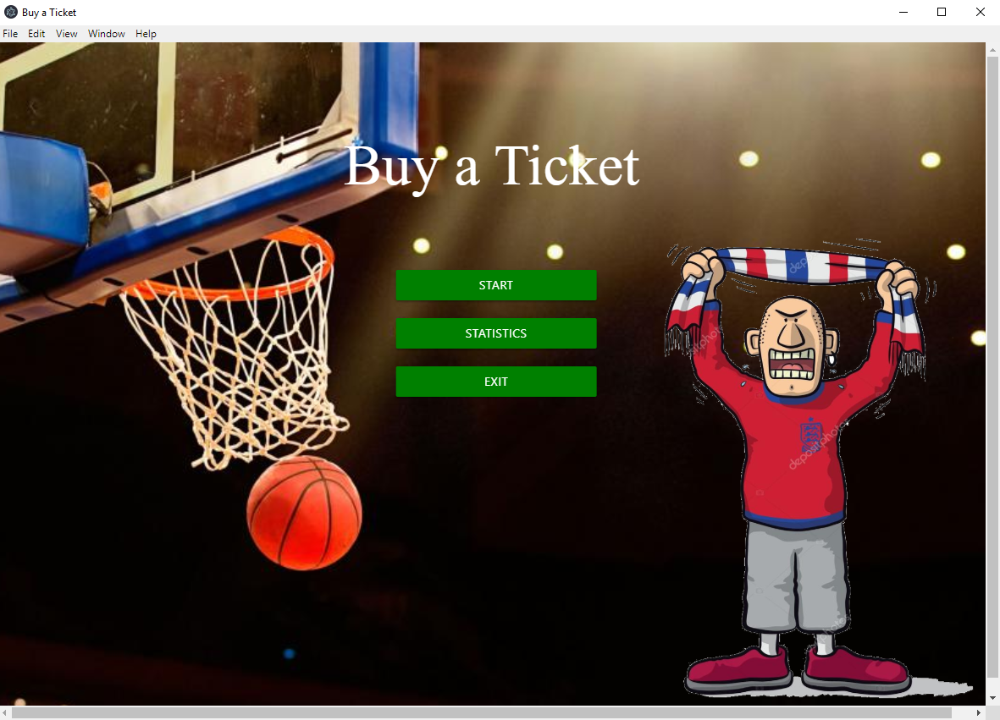
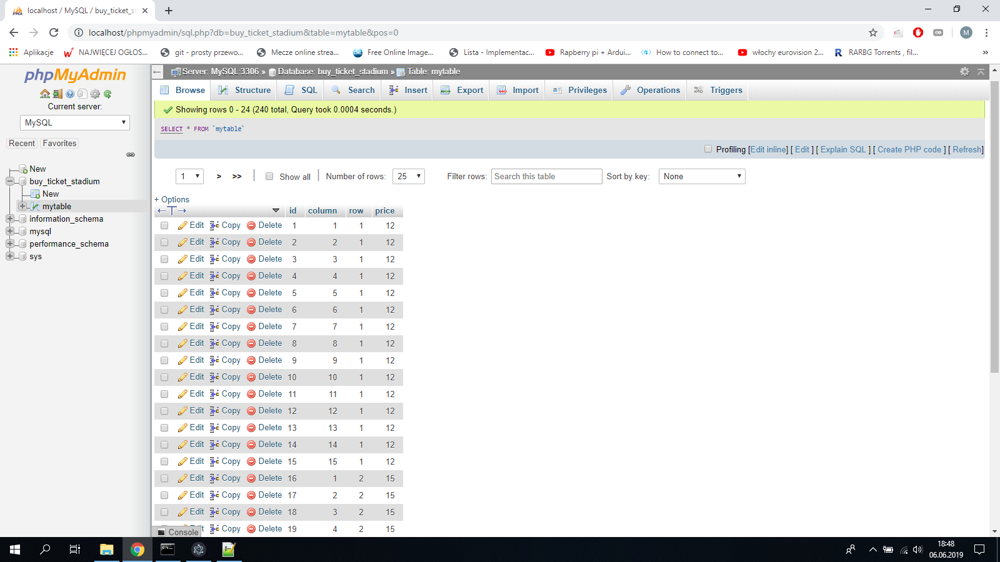
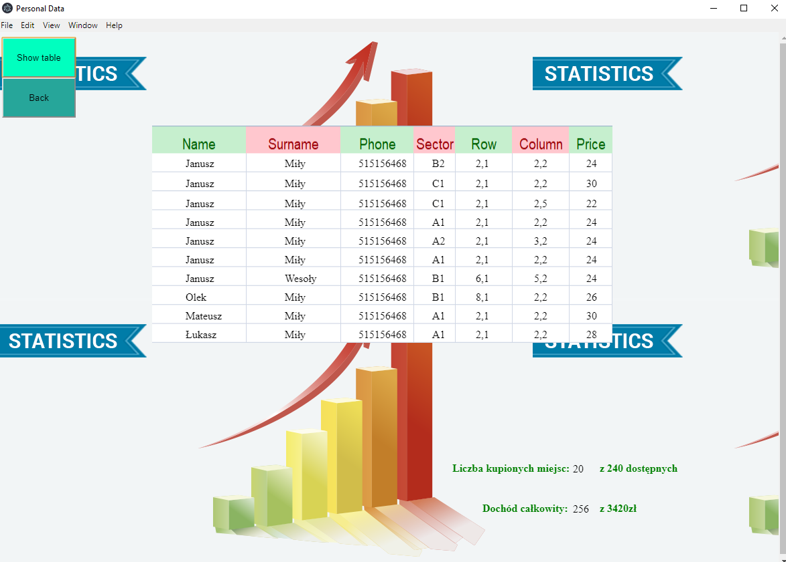
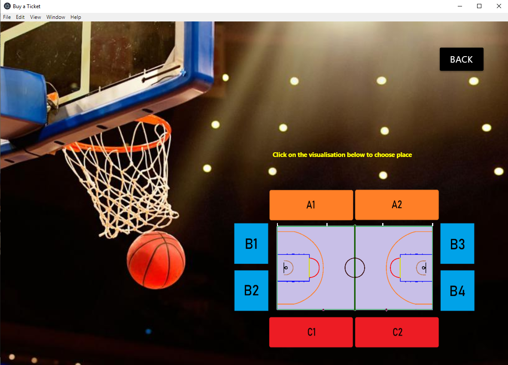
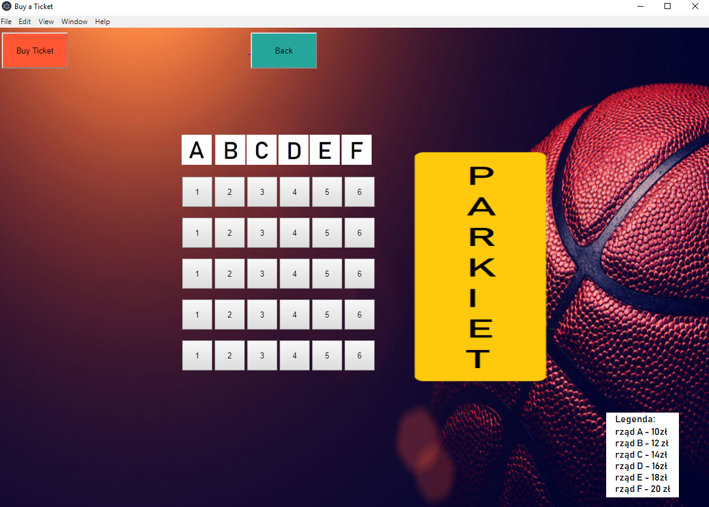

# Buy Stadium Ticket

Projekt zakładał stworzenie funkcjonalnej aplikacji do zakupu miejsca na hali sportowej. Baza danych stworzona w phpMyAdmin zawiera informacje dotyczące rozkładu każdej z trybun, a konkretnie, każdego miejsca znajdującego się na trybunach. Każde miejsce definiowane jest przez unikatowe ID,rząd, kolumne oraz cenę. 
Aplikacja posiada wizualizację trybun  , gdzie użytkownik może kliknąć na wybrany sektor i wykupić dowolne wybrane przez siebie miejsce. W momencie wybrania danego miejsca przechodzimy do formularza z danymi, który pozwoli nam zakupić bilet. Apka posiada funkcję przeglądania aktualnych statystyk wykupionych miejsc, zarobionych pieniędzy ze sprzedaży oraz aktualną tabelę z zakupionymi miejscami oraz danymi osób, które zakupiły dany bilet, umieszczone w tabeli, która pobiera pliki z pliku json.  Apka pod node.js, electron i baza danych PhpMyAdmin.        
