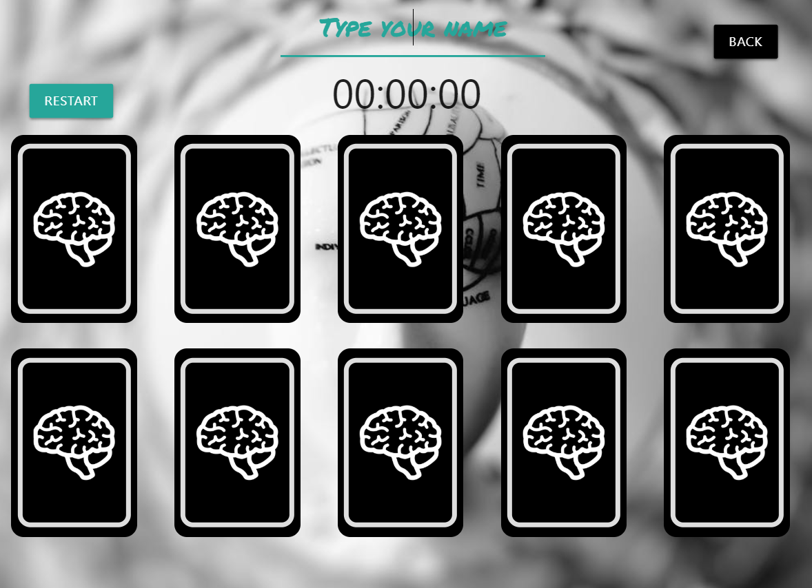
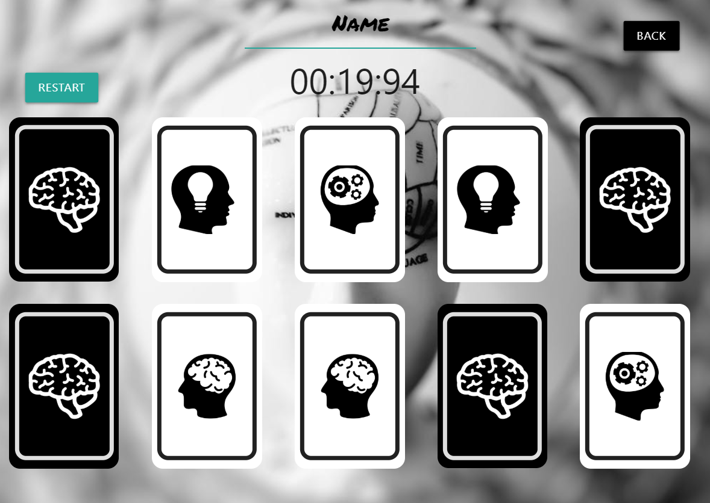
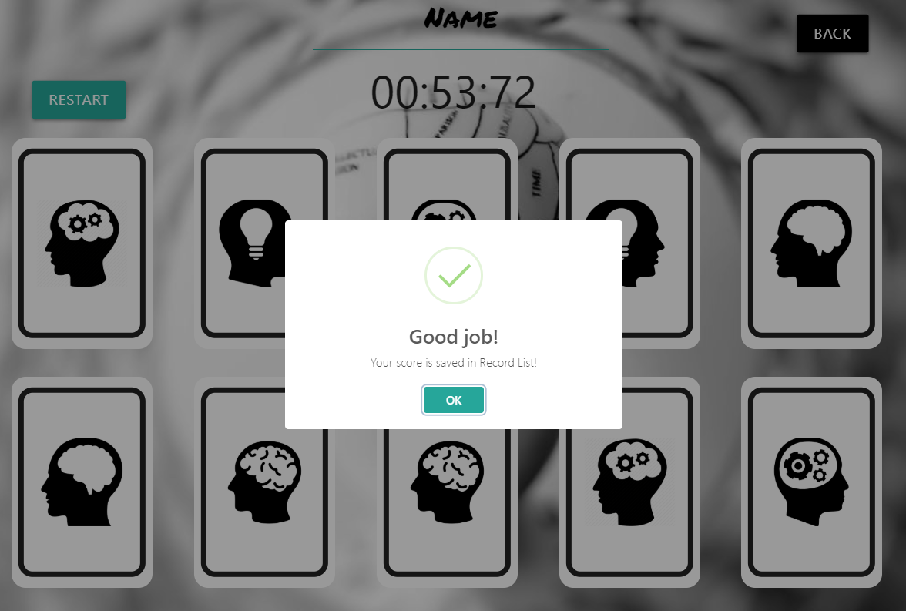
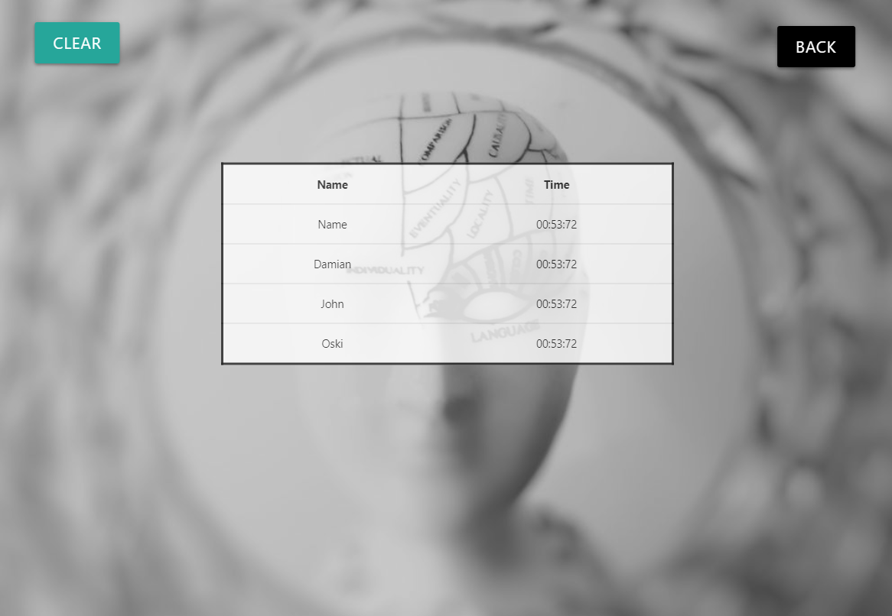

# Memory Game

This project contains a simple card game. The object of the game is to try to remember the location of different cards and find all pairs as soon as possible. After reversing the first card, the time begins. When a player turns face up, two identical cards forming a pair they remain uncovered. When a player discovers all cards the game is won. After the win, the user's name and time are saved in the list of records. If you do not give the name, by default this is the "unknow".

## Main screen


 ## Game screen
 
 At the begining of the game, all cards are face down
  


 The player puts successively  cards face up.



When a player win a game his record would be save in Record List.



## Record List screen

Here is a Record List.



## Instalation

Clone the repository to your directory. Open command line  in this folder and write 
````bash
npm install 
npm start
````
Enjoy the game.
